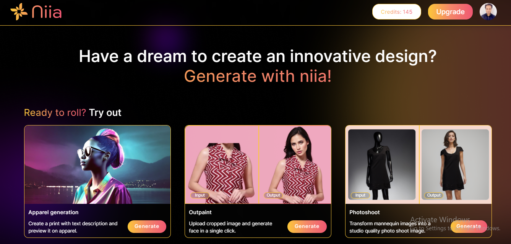
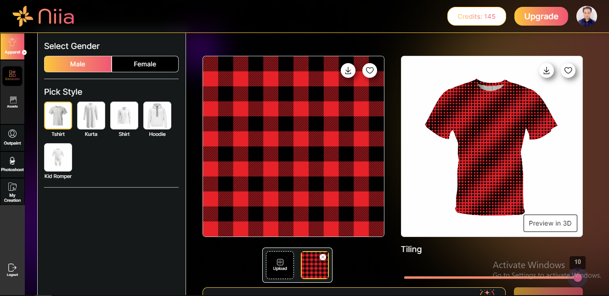

# Apparel Generation

To generate an apparel design you need to follow the steps below.

**Step 1:** Click on the "generate" button on the box with title "Apparel generation".

You will be taken to this page, where you can select the gender, choose any silhouette available below. And can also toggle between various pages on the left sidebar.

**Step 2:** Upload an image containing any design or pattern of your choice.

Now the uploaded design or pattern will get imprinted on the generated design

Also increase or decrease the slider to access the tiling feature where you can alter the number of repeats to be generated on your pic, save or archive the pic for later purposes.

Now click the "Preview in 3D" button to view your generated design on a live 3D environment, where you can zoom in zoom out by scrolling, choose various environments, fabrics, silhouettes, reset camera & capture screenshot according to your needs.

And you can generate your avatar by clicking on "Show avatar" buttton.

Else, if you have your own design in your mind, you can generate that by giving prompts as follows:

**Step 3:** Start giving prompts of any design or pattern of your choice. For example Floral print in pink colour. And press "Generate" button.

And viola! The design is generated as per your input prompt.
