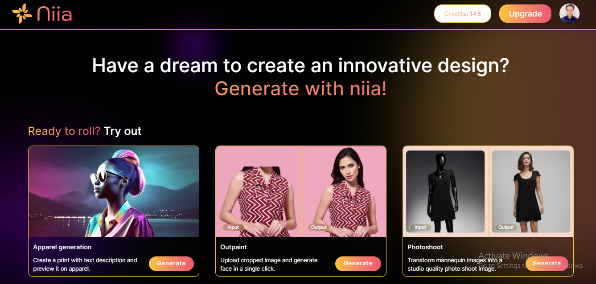
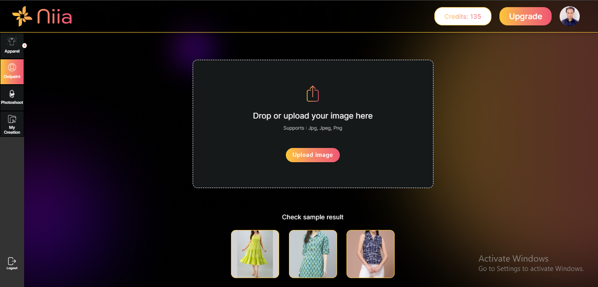
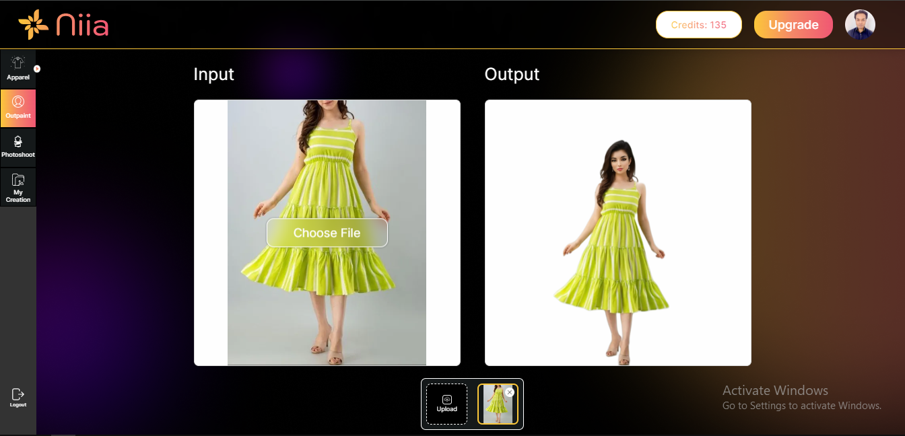
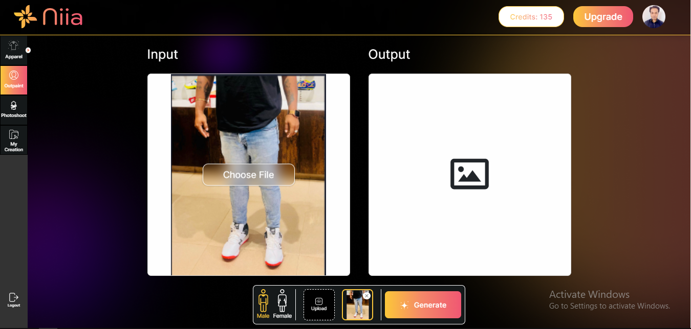
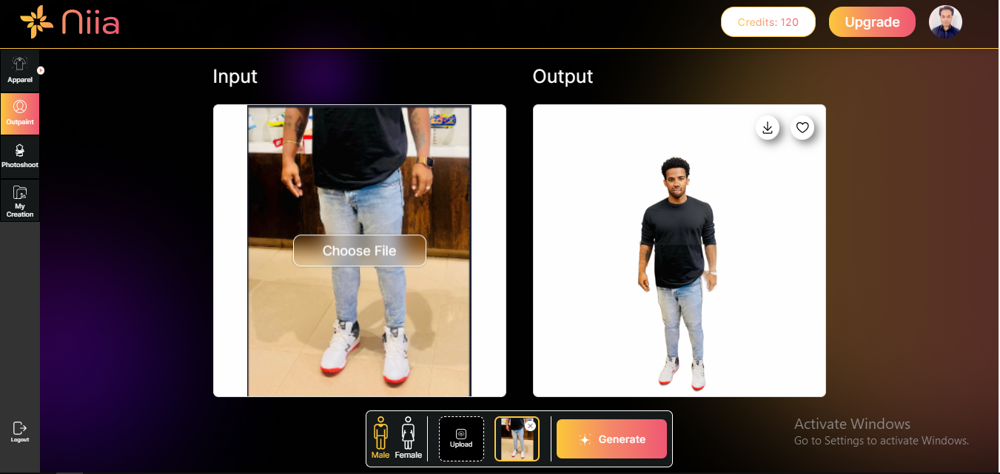

# Outpaint

To generate an outpainted face of an AI photoshoot model you need to follow the steps below.

**Step 1:** Click the "generate" button on the box with title "Outpaint".

You will be taken to this page, where you can upload an image of a mannequin or a live picture of a person which can be generated into a live AI photoshoot model. And you can also toggle between various pages on the left sidebar.

Here you can click the sample images provided below to get a preview of how your image will be generated into an AI photoshoot model.

**Step 2:** Upload a live image of a person, select their gender and click "generate".

Now you have generated a live AI photoshoot model of an image of a person.

You can either download, regenerate or delete the generated AI photoshoot model.
