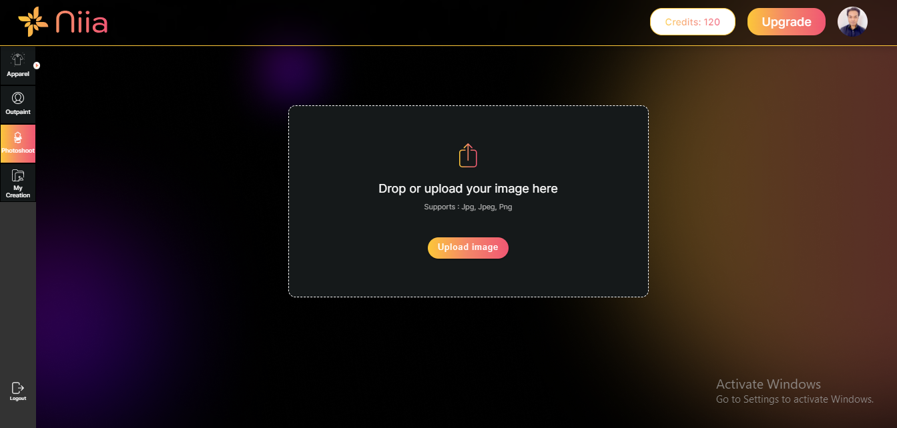
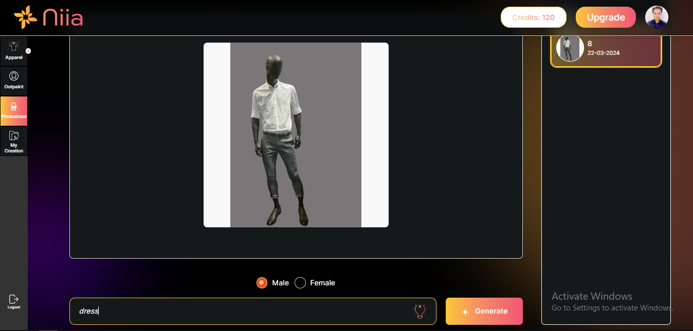
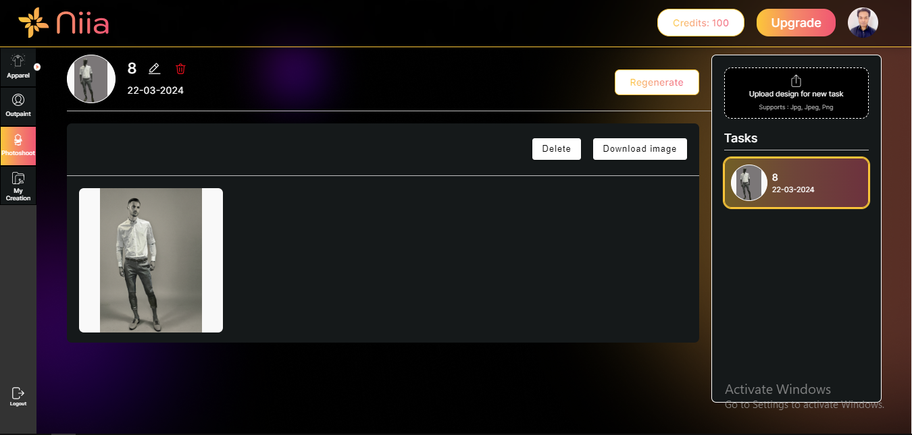

# Photoshoot

To generate a live person photoshoot model you need to follow the steps below.

**Step 1:** Click the "generate" button on the box with title "Photoshoot".

You will be taken to this page, where you can upload an image of a mannequin which can be generated into a live person photoshoot model. And you can also toggle between various pages on the left sidebar.

**Step 2:** Upload an image of a mannequin, select its gender, describe what it is wearing as a prompt input and click "generate".

Now you have generated a live person photoshoot model of an image of a person.

You can either save or archive the generated photoshoot model for later purposes.
